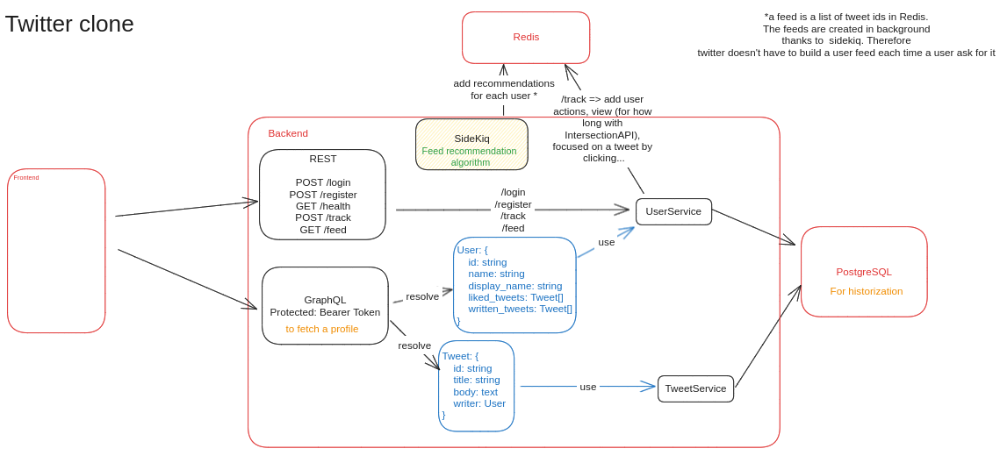

# README

## Architecture



## Commands done

```bash
rails new twitter
cd twitter
sudo bundle install

# troubleshooting `bundle install`
sudo apt install libyaml-dev
sudo gem install psych

sudo bundle install

bin/rails server

# generating posts coontroller
bin/rails generate controller Tweets index --skip-routes
bin/rails generate model Tweet title:string body:text
docker compose up -d
```
